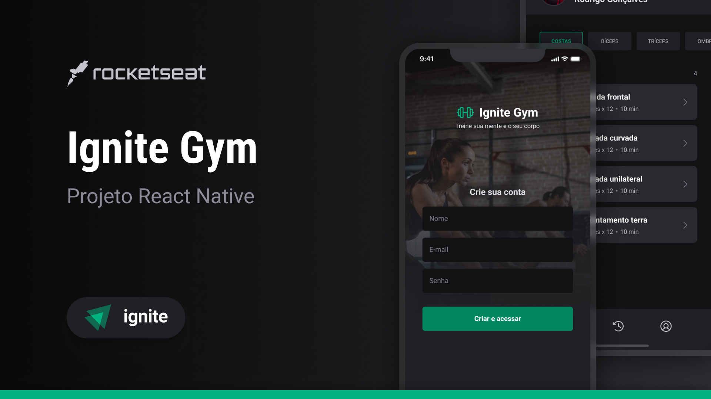

# Daily Diet



## 👨🏽‍💻 Stack

- [x] React Native
- [x] Typescript
- [x] GlueStack

##

# Sobre o projeto

Desafio proposto pela @rocketseat. Neste desafio, desenvolvi uma aplicação de academia onde o usuário recebe os exercícios vindos da API e consegue ver quais exercícios já fez.

- Usuário consegue alterar os dados dele.
- Usuário consegue marcar uma tarefa como realizada.
- Usuário consegue verificar o histórico de atividades já feitas.
- Usuário consegue alterar a foto de perfil.
- Navegação entre telas em pilha e bottom tabs.
- Armazenamento local e online das atividades físicas, com tratamento de loading em todas as telas.
- Uso de componentes reutilizáveis.
- Hook Form para melhor gestão de formulários.
- Uso de toast para melhorar a experiência do usuário.
- Aplicado refresh token.

## Executando o projeto

Faça o clone deste projeto em seu computador e depois execute com npm ou yarn.

Para rodar o projeto mobile

```bash
cd mobile
## Instalação:
npm install or yarn add
## Executando o projeto
yarn start or npm start
```

Para rodar a API:

```bash
cd api
## Instalação:
npm install or yarn add
## Executando o projeto
yarn dev or npm run dev
```
